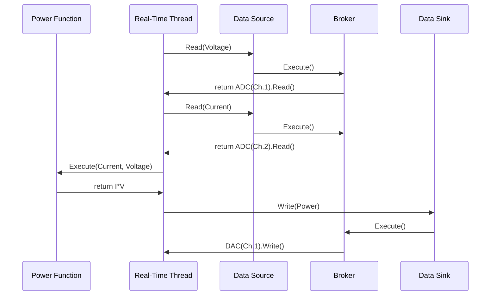

# Overview

This repository contains some demonstrations of documentation generated automatically for real-time 
control programs developed with the MARTe2 system.

## Graphviz Generation

The MARTe2-tools repository (not yet published in public) contains three applications for parsing and analysing MARTe2 application descriptions.
MARTe2 applications can be described using three alternative formats : cdb (configuration database - the traditional markup), json, and XML.

1. CfgToString.ex : creates a large C string variable from a complete application file.
2. CfgToCfg.ex : transforms an application description from cdb/json/xml to cdb/json/xml
3. CfgToDot.ex : generates a series of several graphviz (dot) graphs which describe parts of the application

See [*this detailed explanation*](doc/overview.md)  with an example application.

## CfgToDot

A MARTe2 application is defined in several stanzas which describe respectively :

1. Interfaces : optional components that provide bindings to external applications over a variety of protocols (HTTP, CA, ...)
2. StateMachine : an optional component for applications which require several states.  One state is active at one time.
3. Data Sources and Data Sinks : mandatory components which provide the route for data into or out of the real-time threads.
4. States : at least one state, which must hold at least one Real-Time thread.
5. Real-Time Threads : a container of functions and other executable objects which implement a data pipeline
6. Scheduler/Timer : a supervisory service for orchestrating the pace of real-time threads.

<!-- last updated : @f8:~/Projects/MARTe2-sigtools/MARTe2-doctools -->
