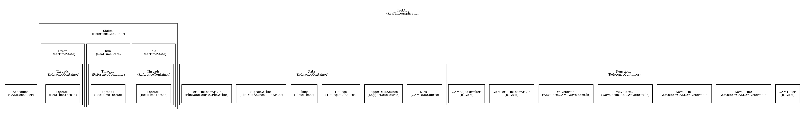
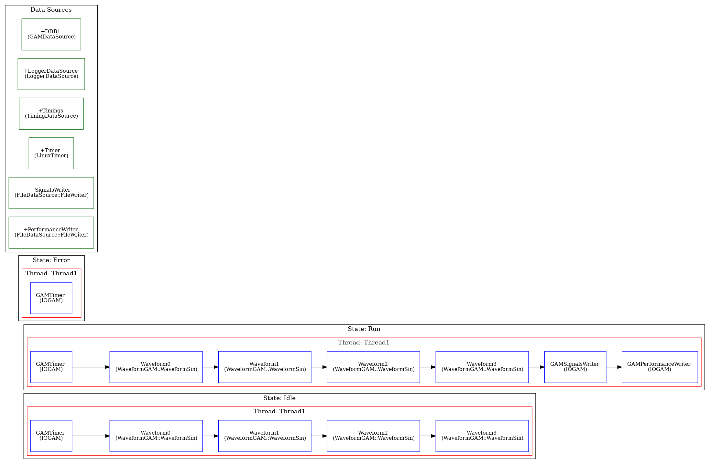

# Overview

This repository contains some demonstrations of documentation generated automatically for real-time 
control programs developed with the MARTe2 system.

## Graphviz Generation

The MARTe2-tools repository (not yet published in public) contains three applications for parsing and analysing MARTe2 application descriptions.
MARTe2 applications can be described using three alternative formats : cdb (configuration database - the traditional markup), json, and XML.

1. CfgToString.ex : creates a large C string variable from a complete application file.
2. CfgToCfg.ex : transforms an application description from cdb/json/xml to cdb/json/xml
3. CfgToDot.ex : generates a series of several graphviz (dot) graphs which describe parts of the application

## CfgToDot

A MARTe2 application is defined in several stanzas which describe respectively :

1. Interfaces : optional components that provide bindings to external applications over a variety of protocols (HTTP, CA, ...)
2. StateMachine : an optional component for applications which require several states.  One state is active at one time.
3. Data Sources and Data Sinks : mandatory components which provide the route for data into or out of the real-time threads.
4. States : at least one state, which must hold at least one Real-Time thread.
5. Real-Time Threads : a container of functions and other executable objects which implement a data pipeline
6. Scheduler/Timer : a supervisory service for orchestrating the pace of real-time threads.

Taking a simple example, the CfgToDot tool produces the following set of graphviz diagrams.
To make this concrete, we take the case of the [Sigtools/Waveform-1a](../examples/Sigtools/Waveform-1a/) application

### Objects Graph

This is a [flat view](../examples/Sigtools/Waveform-1a/sta_Objects_0.png) of the objects created in the application and how they are nested.
In respect of the 6 levels set out above it shows that the application comprises

- A simple Scheduler
- Three states : Idle, Run, and Error.  Each state holds a single Real-Time Thread.
- A Data container with writers, timers and logger.
- Seven functions : a timer, four waveforms, and two writers.

At the object existence level, the relationships are hidden.  e.g. That each of the three real-time threads includes
a subset of the functions.

### Real-Time Application Graph

This is a [hierarchical view](../examples/Sigtools/Waveform-1a/sta_RTApp.png) of the application, which gives a sense of the 
execution order.   It shows the data sources and sinks in a group. Below this, for each *State* it shows the encapsulated
Real-Time thread and the order in which the functions in that thread are called.  Note that the implicit broker executable
objects are hidden from view in this analysis, because they are not visible directly from the application definition file.

For each function in each thread, the function name and the class from which it is instantiated (though not yet the parameters)
are shown.

