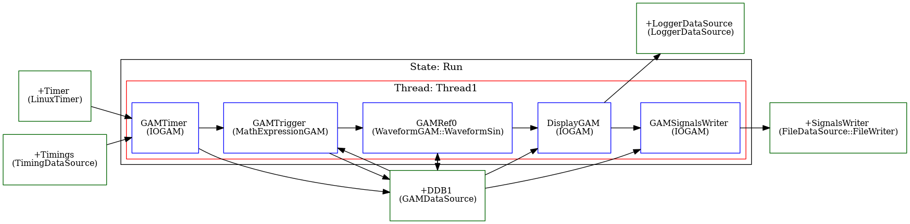

# MARTe Demo : FileWriter-1

The first FileWriter example demonstrates how to condition whether or not signal data is appended to a file
based on the current time.  It works as follows

1. Time in microseconds comes from a standard LinuxTimer data source.
2. The thread is paced at 200Hz.
3. A trigger signal is computed based on comparing current time against 1.0s
4. A sine waveform is evaluated based on the current time.
5. The sine value is displayed on the console via the LoggerDataSource (unconditionally).
6. The sine value is sent to the SignalsWriter.
7. The SignalsWriter is configured to store 2 samples pre-trigger and 2 samples post-trigger.
8. If the trigger is 1, then 5 values are written to file, timestamped accordingly.



A [short video of the example running](https://www.youtube.com/watch?v=-GuBPVnREkc) is available.

There are two options for running the demo.  The simple case is to start the application directly in the Run state thus:

## Interactive Format

Start the docker and set up the environment to launch MARTe.

```
docker run -it -p 8084:8084 avstephen/marte2-demos-sigtools-ubuntu1804:ayr
root@abcedf:/opt/MARTe/Projects/MARTe2-sigtools/bin# source setenv.sh
root@abcedf:/opt/MARTe/Projects/MARTe2-sigtools/bin# source m2-completion.bash
```

Two terminals are required to see the behaviour matches expectations, though judicious use of `date` 
and `stat` can help prove that example does what is says on the tin.

In the first terminal, set up to watch for the expected creation of a file, which by default is
to be created in the MARTe2-demos-sigtools/temp directory.

```
root@abcedf:/opt/MARTe/Projects/MARTe2-sigtools/bin# cd ../MARTe2-demos-sigtools/temp
root@abcedf:/opt/MARTe/Projects/MARTe2-sigtools/MARTe2-demos-sigtools/temp# rm -f *.csv
root@abcedf:/opt/MARTe/Projects/MARTe2-sigtools/MARTe2-demos-sigtools/temp# watch -n 1 ls
```

In the other terminal, run the example

```
root@abcedf:/opt/MARTe/Projects/MARTe2-sigtools/bin# ./m2 STapp-0007-FileWriter-1.cfg -s Run
```

Note that on the console, after the initial flurry of setup messages, the DisplayGAM output will show the time (updating in increments of 5000us = 5ms consistent with running at 200Hz).  It also shows the value of the trigger signal (comparison with 1)

Wait until you see the trigger signal passing 1 (this can take more than one second, because startup of the MARTe application takes a few seconds).  Then kill MARTe with Ctrl-C and check the information in the csv file.  The watch command running `ls` every second should have already shown that the file was created.

## Automated Format

Create a simple bash script as follows to do everything in one.

This script is available for the moment [here](https://github.com/AdamVStephen/MARTe2-sigtools/blob/ayr/bin/md-fw-1).

```
!/usr/bin/env bash
rm -f ../MARTe2-demos-sigtools/temp/*.csv
start_time=$(date --rfc-3339='ns')

./m2 STapp-0007-FileWriter-1.cfg -s Run > /tmp/log 2>&1 &
echo "MARTe started at $start_time"
echo "Waiting for 15 seconds"

sleep 15 && pkill MARTe

echo "Last modification to the log was"
stat -c %y /tmp/log

echo "Last modification to the csv was"
stat -c %y ../MARTe2-demos-sigtools/temp/*.csv

echo "Contents of the csv file"
cat ../MARTe2-demos-sigtools/temp/*.csv

echo "Timestamps should run from 990000 to 1005000"
```


## Suggested Exercises

Rather than put the application straight into the run state, start it as follows.  Now use your web browser
to trigger the state machine inputs such that it move into the run state.

```
docker run -it -p 8084:8084 avstephen/marte2-demos-sigtools-ubuntu1804:ayr
root@abcedf:/opt/MARTe/Projects/MARTe2-sigtools/bin# source setenv.sh
root@abcedf:/opt/MARTe/Projects/MARTe2-sigtools/bin# export PS1="# "
root@abcedf:# source m2-completion.bash
root@abcedf:# ./m2 STapp-0007-FileWriter-1.cfg -m StateMachine:START
```


