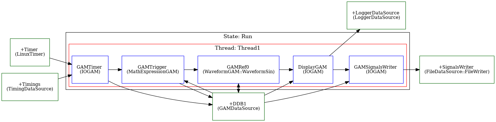

# MARTe Demo : FileWriter-2

The second FileWriter example also demonstrates how to condition whether or not signal data is appended to a file
based on the current time. In contrast to FileWriter-1, the trigger signal is defined as a repeating signal which
asserts acquisition for `record time` every `interval`.  e.g. Selecting to record 50ms of samples every 1 second.
```mermaid
gantt
    title FileWriter-2
    dateFormat  X
    axisFormat  %L
	section Acquisition
	Acquire 1           : 0, 0.05
	Acquire 2           : 1.0, 1.05
	section Delay
	Delay 1           : 0.05, 0.95
	Delay 2           : 1.05, 1.95
```
It works as follows

1. Time in microseconds comes from a standard LinuxTimer data source.
2. The thread is paced -t 200Hz.
3. A trigger signal is computed as `(t modulo interval) < record time`
4. A sine waveform is evaluated based on the current time.
5. The sine value is displayed on the console via the LoggerDataSource (unconditionally).
6. The sine value is sent to the SignalsWriter.
7. The SignalsWriter is configured with zero sized pre/post trigger buffers.
8. While the trigger is asserted, the sine values are recorded to file.



There are two options for running the demo.  The simple case is to start the application directly in the Run state thus:

## Interactive Format

Start the docker and set up the environment to launch MARTe.

```
docker run -it -p 8084:8084 avstephen/marte2-demos-sigtools-ubuntu1804:ayr
root@abcedf:/opt/MARTe/Projects/MARTe2-sigtools/bin# source setenv.sh
root@abcedf:/opt/MARTe/Projects/MARTe2-sigtools/bin# source m2-completion.bash
```
Two terminals are required to see the behaviour matches expectations.

In the first terminal, set up to watch for the changing contents of a file, which by default is
to be created in the MARTe2-demos-sigtools/temp directory.

```
root@abcedf:/opt/MARTe/Projects/MARTe2-sigtools/bin# cd ../MARTe2-demos-sigtools/temp
root@abcedf:/opt/MARTe/Projects/MARTe2-sigtools/MARTe2-demos-sigtools/temp# rm -f *.csv
root@abcedf:/opt/MARTe/Projects/MARTe2-sigtools/MARTe2-demos-sigtools/temp# watch -n 1 cat *.csv
```

In the other terminal, run the example

```
root@abcedf:/opt/MARTe/Projects/MARTe2-sigtools/bin# ./m2 STapp-0007-FileWriter-2.cfg -s Run
```

Note that on the console, after the initial flurry of setup messages, the DisplayGAM output will show the time (updating in increments of 5000us = 5ms consistent with running at 200Hz).  It also shows the value of the trigger signal (comparison with 1)

Wait until you see the trigger signal passing 1 (this can take more than one second, because startup of the MARTe application takes a few seconds). The watch command running `cat *.csv` every second should show the snapshot data updating every second.

## Automated Format

Create a simple bash script as follows to do everything in one.

This script is available for the moment [here](https://github.com/AdamVStephen/MARTe2-sigtools/blob/ayr/bin/md-fw-2).

```
!/usr/bin/env bash
rm -f ../MARTe2-demos-sigtools/temp/*.csv
start_time=$(date --rfc-3339='ns')
./m2 STapp-0007-FileWriter-2.cfg -s Run > /tmp/log 2>&1 &
watch -n 1 cat ../MARTe2-demos-sigtools/temp/*.csv
echo "MARTe started at $start_time
```

Since this is a continuous demo, the script then has to be exited and you need to cleanup with `pkill MARTe`.

## Suggested Exercises

TBA
